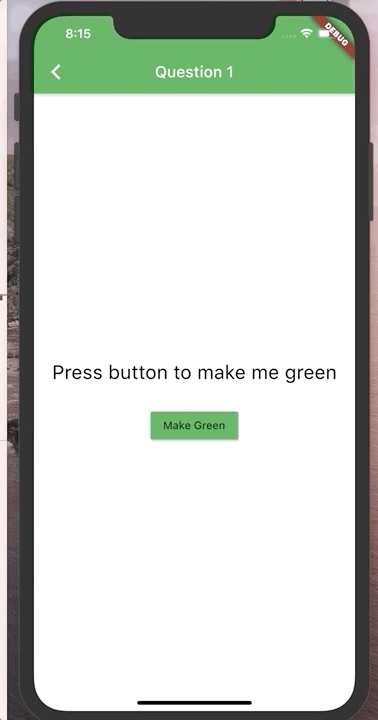
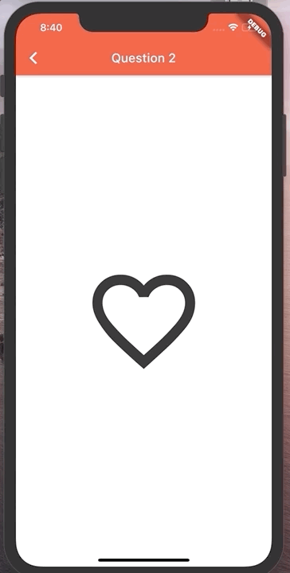
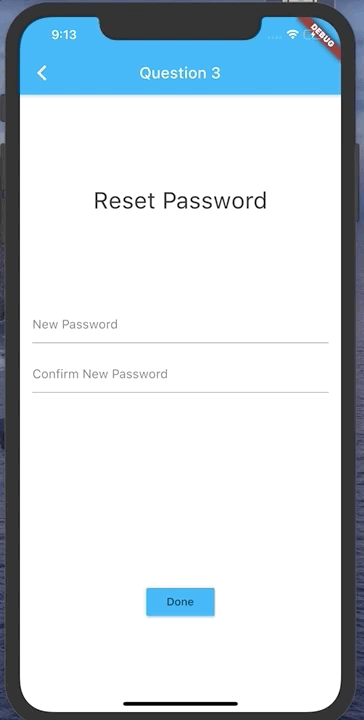
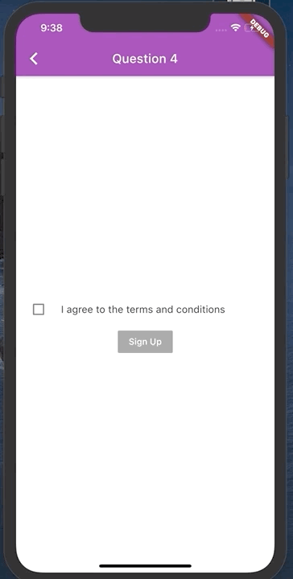
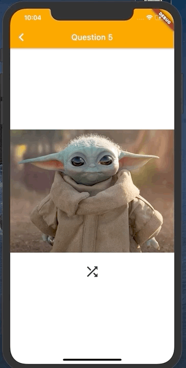

# Homework 4 - Flutter Interactivity

The objective of this homework assignment is to practice working with **Stateful Widgets**. For this homework you'll have to add interactive stateful Flutter widgets for each of the questions so that they match the screenshots provided.

All you modifications/changes will go under:
`lib/questions/`

You will change **question#.dart** files.

The starting point for the whole application is: 
`lib/main.dart`

## Question 1

You will need to write up the **onPressed** function in order to make the text turn <span style="color:green;">green</span> when pressed.

**Hint**: You will need to make a Boolean variable to determine if the button was pressed. Using this variable you can use an if conditional or <u>ternary operator</u> to know which color to assign to the Text.

**Ex**:
```dart 
...
// this is a ternary operator: 
//<boolean expression> ? <result when true> : <result when false>
color: _wasPressed ? Colors.green : Colors.black

...

```
<br/>

**NOTE**: Don't forget to call `setState()` when you handle the button press, otherwise Flutter won't know to rebuild the UI.



## Question 2

You will need to write up the IconButton to toggle between filled/unfilled heart.

**Hint**: You will need to use two icons `Icons.favorite_border` & `Icons.favorite`. Simillar to Question 1, this time you will need to swap the icons depending on the state your variable holds.




## Question 3

For this question you will be working with TextFields and [TextEditingController](https://api.flutter.dev/flutter/widgets/TextEditingController-class.html). The TextEditingController allows you to access/modify the content of the TextField.

Two TextEditingController variables have been provided and assigned to their respected Textfields.

```dart
TextEditingController newPasswordTextEditingController =
      TextEditingController();

  TextEditingController confirmNewPasswordTextEditingController =
      TextEditingController();
```

```dart
// Assigning TextEditingController to the TextField
TextField(
    ...
    controller: newPasswordTextEditingController,
    ...
)
```

You will need to write up the Done button so that when it's pressed it checks 
if the two text fields have the same password. If the passwords don't match, display 
**"Passwords Don't Match"**




## Question 4

**NOTE**: When you first run Question 4 you will see that both the checkbox and button are disabled. This occurs when `onChanged`/`onPressed` are set to **null**

For this question you will need to handle the state of the checkbox when checked the "Sign Up" button should become enabled. 
(The Sign up button doesn't need to do anything when pressed.)

**Hint**: The `onChanged` callback has a parameter which represent if the checkbox was checked/unchecked (true/false)
```dart
onChanged : (newValue) {}
```

You will need to use the button behavior of beeing disabled when given a null callback

```dart
onPressed: agreed ? () {} : null
```



## Question 5 

Remember the Baby Yoda question from the previous homework?
Well today the requirements have changed, instead of showing a single Baby Yoda image you now will need to cycle between three images when the the icon button is pressed.

As you might recall the last homework was about **Stateless** widgets so for this question you will need to convert that widget into a **Stateful** widget before adding in the image cycling feature that require state.

**Note**: Sometimes it take a few seconds for the images to load from the internet, that's ok.

**URLs**:

"https://i.insider.com/5e32f2a324306a19834af322?width=1800&format=jpeg&auto=webp"

 <br/>

"https://i.insider.com/5de2cd3fe94e8635a17ca8ae?width=1100&format=jpeg&auto=webp"

<br/>

"https://media4.s-nbcnews.com/j/newscms/2019_47/3112746/191121-baby-yoda-cs-959a_ed40d38efa3cde7ab92df2d5492a81a5.fit-1120w.jpg"

<br/>


<br/>

## Grading Criteria

| Task | Value of each task | Possible Points Lost |
|---|---|---|
| Question 1 | 20 points | If the text does not turn green when the button is pressed (No credit awarded) <br> Note: (you don’t have to make the text go from green to black again) |
| Question 2 | 20 points | If the icon is not changed when pressed (No credit awarded) |
| Question 3 | 20 points | If the passwords don’t match/get the error message but the error doesn’t disappear when they are the same. (10 points deduction) <br> If the passwords don’t match and you don’t get the error message (No credit awarded) |
| Question 4 | 20 points | If the checkbox does not change the state of the signUp button (No credit awarded) |
| Question 5 | 20 points | If images don’t change when the button is pressed (No credit awarded) |
| | 100 points total | |


